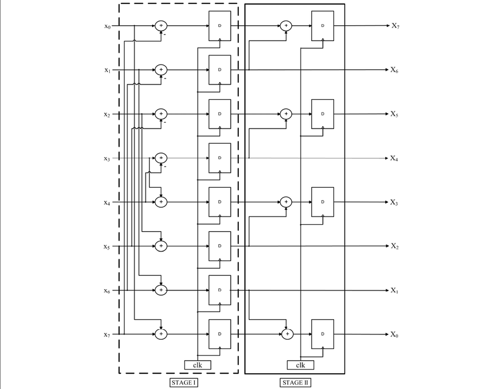

# Approximate-1D-DCT-architecture
# Introduction: 
This is a Verilog implementation of the 1-D 8-point DCT architecture. It implements an approximate design which uses only 12 adders and no multipliers, for the whole computation. The pipeline consists of 8 adder blocks which compute different bit positions of the consecutive operands in the pipeline. The delay involved due to ripple carry generation is utilized to perform other independent tasks, for performance gain.
# Requirements: 
The Xilinx Vivado Design Suite (Vivado 2019.1) was used for HDL sysnthesis and analysis. The installation guide is [here](https://www.xilinx.com/support/download/index.html/content/xilinx/en/downloadNav/vivado-design-tools/2019-1.html). Simulation waveform can be seen on the Vivado Simulator and the user needs to provide the input text file to the testbench. 
# Customised Input:
Testbench input generation:  The input sequence is provided as a text file. Run the python script gen_in.py to generate the input .txt file. The module takes a csv file as input, whose elements are 8 bit binary representation of the elements (8 in each row).  Check out the given input files in the examples folder for more clarification.  Note: This specific pattern guides the order in which the instructions are given to the pipeline. 
# Pipelined Execution:
The inputs are provided in a specific sequence to the pipeline and the Null operations mark the clock cycles in which the Stage II computations would be performed.  Refer to the diagram below 
